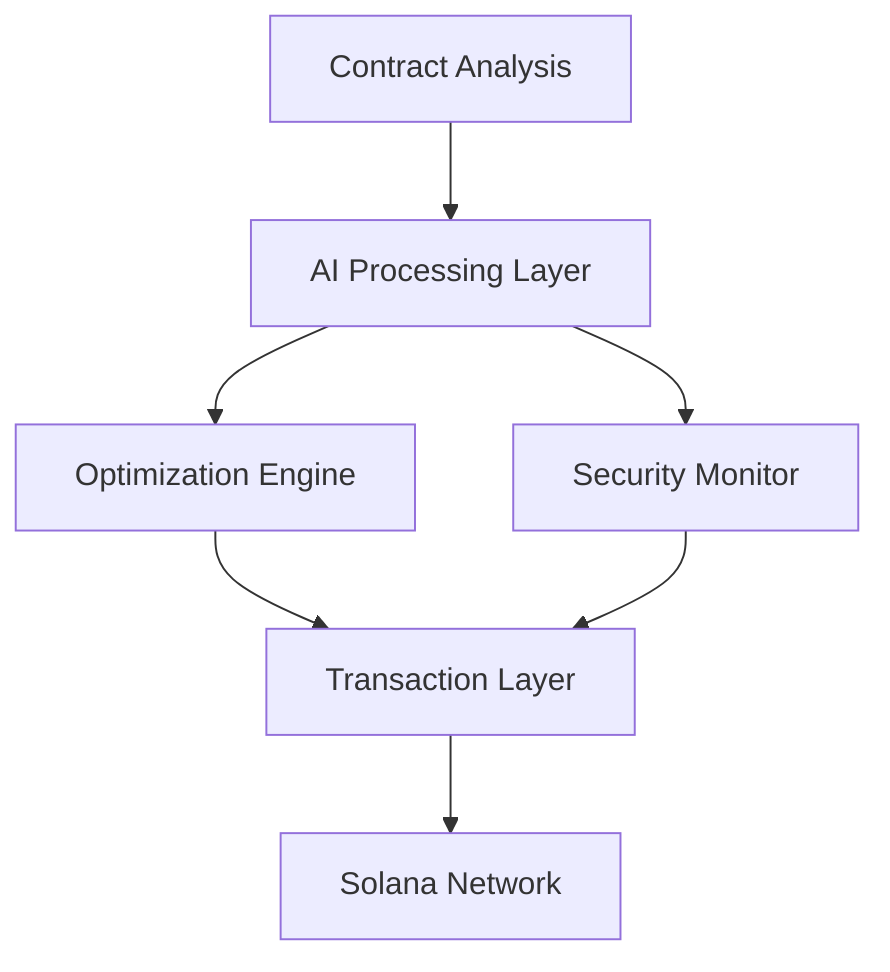

# Manof - AI Agent Framework for Solana Smart Contracts

<div align="center">
    <h3>🤖 Intelligent Contract Interaction Framework on Solana</h3>
</div>

## 🌟 Overview

Manof is an advanced AI agent framework designed specifically for interacting with and optimizing Solana smart contracts. It combines artificial intelligence with blockchain technology to create autonomous agents capable of analyzing, interacting with, and optimizing smart contract operations.

## ✨ Key Features

- **🧠 Smart Contract Intelligence**
  - Automated contract analysis and optimization
  - Pattern recognition in contract behavior
  - Risk assessment and security analysis
  - Gas optimization recommendations

- **🔄 Real-time Contract Interaction**
  - Automated transaction management
  - Dynamic parameter optimization
  - MEV protection strategies
  - Real-time market analysis integration

- **🛡️ Security Framework**
  - Continuous security monitoring
  - Anomaly detection
  - Automated audit capabilities
  - Threat prevention systems

- **⚡ Performance Optimization**
  - Transaction timing optimization
  - Gas usage optimization
  - Parallel processing capabilities
  - Resource allocation management

## 🏗️ Architecture



## 🚀 Quick Start

### Prerequisites

```bash
# Install Rust and Solana
curl --proto '=https' --tlsv1.2 -sSf https://sh.rustup.rs | sh
sh -c "$(curl -sSfL https://release.solana.com/v1.16.0/install)"

# Install Node.js dependencies
npm install @solana/web3.js
npm install @project-serum/anchor

# Install Python AI components
pip install -r requirements.txt
```

### Installation

```bash
# Clone the repository
git clone https://github.com/manof-ai/manof
cd Manof

# Install dependencies
cargo build
npm install
```

## 📦 Project Structure

```
Manof/
├── program/                # Solana program files
│   ├── src/               # Smart contract source code
│   └── tests/             # Contract test files
├── app/                   # Client application
│   ├── src/              # Application source
│   └── tests/            # Application tests
├── ai/                   # AI components
│   ├── models/          # AI models
│   ├── training/        # Training scripts
│   └── inference/       # Inference engines
└── docs/                # Documentation
```

## 💡 Core Components

### Contract Analysis Engine
- Static analysis of smart contracts
- Dynamic behavior monitoring
- Performance metrics tracking
- Security vulnerability scanning

### AI Processing System
- Machine learning models for pattern recognition
- Neural networks for optimization
- Natural Language Processing for contract interpretation
- Reinforcement learning for strategy optimization

### Transaction Management
- Automated transaction scheduling
- Fee optimization
- Slippage protection
- MEV mitigation

## 🔧 Development

1. Start local Solana validator:
```bash
solana-test-validator
```

2. Deploy the program:
```bash
anchor deploy
```

3. Run the AI system:
```bash
python ai/src/main.py
```

## 🧪 Testing

```bash
# Run Solana program tests
cargo test

# Run AI component tests
pytest ai/tests

# Run integration tests
npm test
```

## 📖 Documentation

- [Technical Architecture](./docs/architecture.md)
- [AI System Design](./docs/ai-system.md)
- [Smart Contract Integration](./docs/smart-contracts.md)
- [Security Framework](./docs/security.md)
- [API Reference](./docs/api.md)

## 🔐 Security

Manof implements multiple layers of security:
- Real-time contract monitoring
- Automated security checks
- Transaction validation
- Risk assessment systems

## 🤝 Contributing

We welcome contributions! Please see our [Contributing Guidelines](CONTRIBUTING.md).

## 📄 License

This project is licensed under the MIT License - see the [LICENSE](LICENSE) file for details.

## 🔮 Roadmap

- [x] Core AI framework implementation
- [x] Basic contract analysis capabilities
- [x] Transaction optimization engine
- [ ] Advanced security features
- [ ] MEV protection system
- [ ] Multi-chain support
- [ ] DAO integration
- [ ] Advanced optimization algorithms

## 📞 Contact

- GitHub: [@yourusername](https://github.com/manof-ai/manof)
- Twitter: [@Manof](https://x.com/manof_fun)

---

<div align="center">
    Built with 💫 by the Manof Team
</div>
